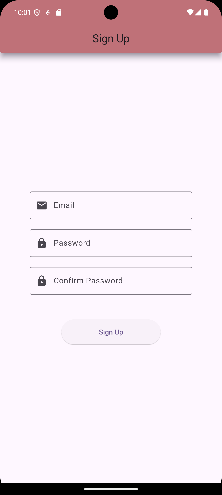
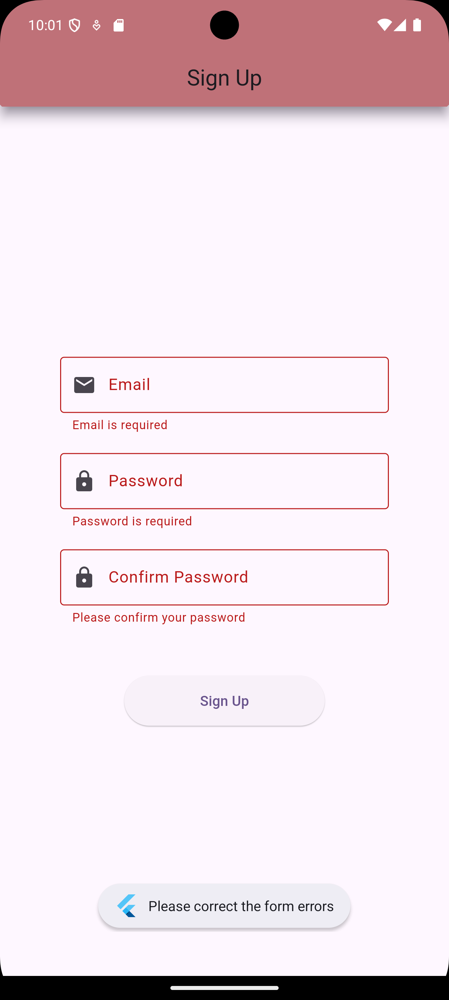
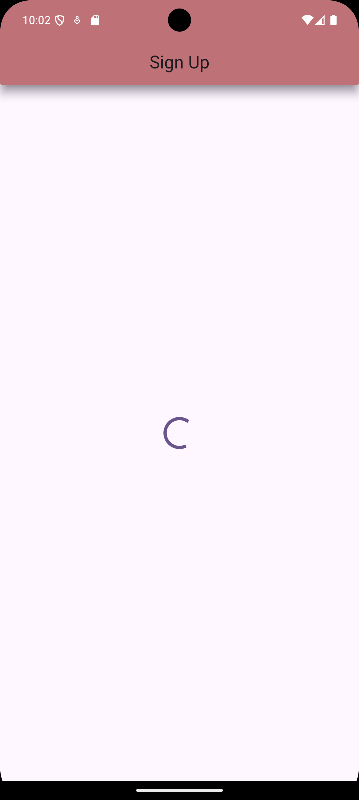
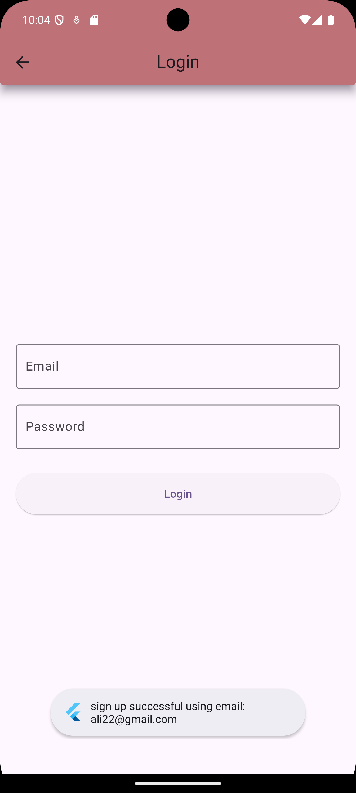
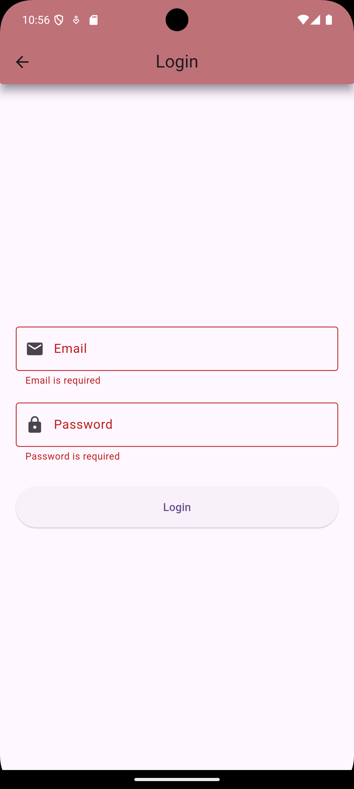
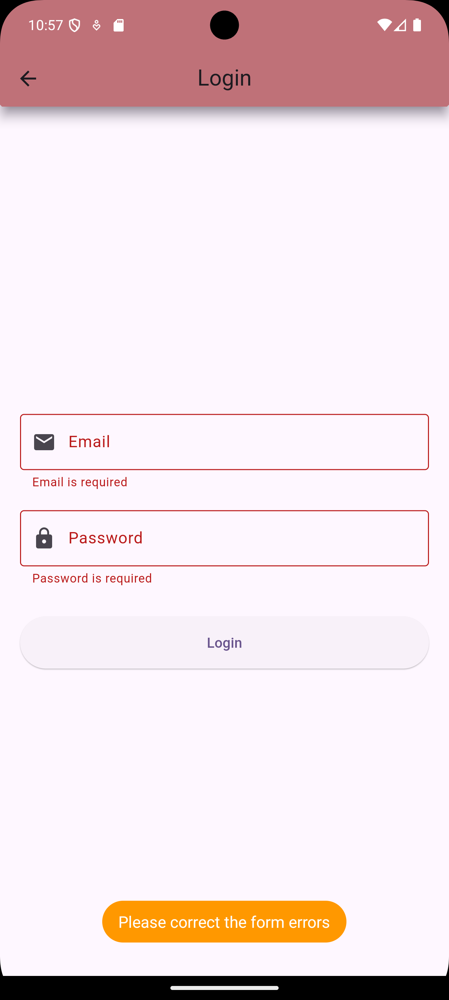
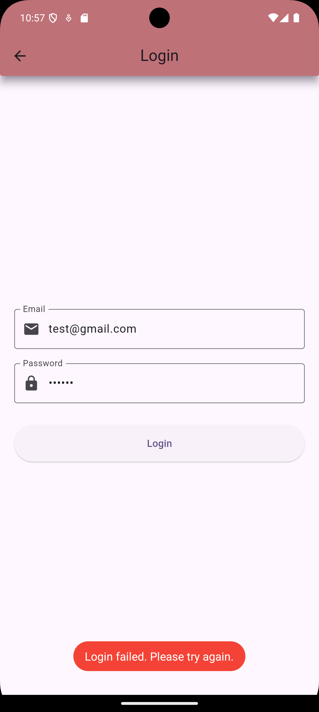
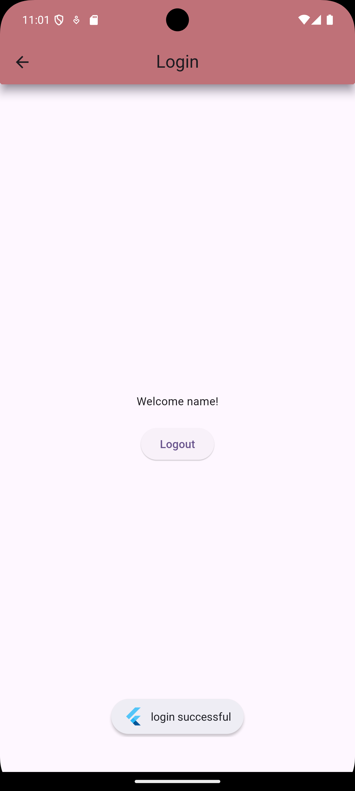

# Firebase Task 6.1 - Flutter Authentication App

This is a Flutter project demonstrating user **Sign Up and Login** using **Firebase Authentication** with **BLoC pattern**.

## 🔥 Features

- Firebase Email/Password Sign Up
- Firebase Email/Password Login
- BLoC Architecture (Clean Code)
- Form Validation
- Toasts for Feedback
- Navigation Between Screens
- Firebase Initialization with `firebase_options.dart`

## 📦 Dependencies

- `firebase_core`
- `firebase_auth`
- `flutter_bloc`
- `fluttertoast`

------
## 🔥 Firebase Auth Login and Sign Up UI

### 📸 Screenshots

#### 🔐 Login Screen

#### 🆕 Sign Up Screens

